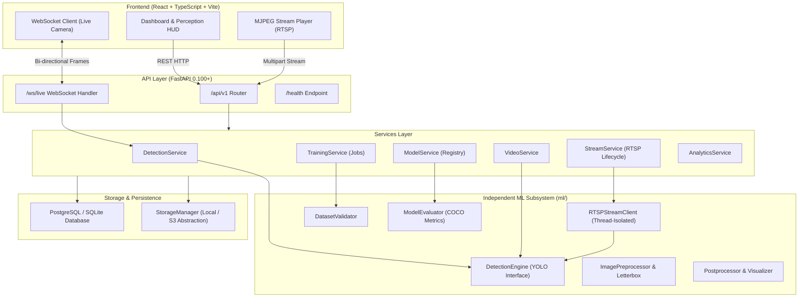

# PROJECT 01 — REAL-TIME AI OBJECT DETECTION PLATFORM
### High-Throughput Perception Engine & Computer Vision Platform

[](https://python.org)
[](https://pytorch.org)
[](https://ultralytics.com)
[](https://fastapi.tiangolo.com)
[](https://react.dev)
[](https://docker.com)
[](https://github.com)

---

## 1. Project Overview

**VISION CORE** is an enterprise-grade, modular, and scalable AI Object Detection Platform engineered around state-of-the-art YOLO architectures. It serves as **Project 01 of a 9-Project Computer Vision & AI Engineering Portfolio**, architected from the ground up as a reusable perception foundation for subsequent systems (Multi-Object Tracking with ByteTrack/BoT-SORT, ANPR & OCR, Traffic Intelligence, Construction Safety, and Multimodal Vision AI).

Rather than a simple one-off script, this platform delivers a layered, decoupled system with independent ML inference, background training pipelines, dataset validation, thread-isolated RTSP streaming, WebSocket-based real-time browser webcam detection, and an interactive dashboard.

---

## 2. Core Capabilities

* **Multi-Modal Detection Pipeline**:
  * **Static Images**: High-resolution image uploads with bounding box generation, confidence/IoU filtering, and annotated result downloads.
  * **Video Streams**: Memory-efficient frame-by-frame streaming processing avoiding out-of-memory errors on large multi-gigabyte video files.
  * **Live Webcam Perception**: Real-time bi-directional WebSocket frame transfer with sub-30ms client-side canvas bounding box overlays.
  * **Industrial RTSP / IP Cameras**: Dedicated thread-isolated capture loops with automatic reconnection, stream health monitoring, and live MJPEG browser previews.
* **Model Registry & Version Management**:
  * Hot-swapping active models at runtime without service restarts.
  * Automatic metadata tracking (mAP50, mAP50-95, Precision, Recall, F1 score, dataset lineage).
  * Custom weights upload (`.pt`, `.onnx`).
* **Custom Model Training Subsystem**:
  * Automated YOLO-format dataset validation (YAML parsing, label coordinate range `[0, 1]` verification, split checks).
  * Non-blocking background training jobs with live epoch progress, loss telemetry, and automatic registration of the resulting `best.pt` weights.
* **Observability & Analytics**:
  * Granular telemetry separating preprocessing, forward inference pass, and postprocessing latencies.
  * Class frequency distribution, stream type analytics, and server CPU/RAM utilization.

---

## 3. System Architecture

The platform follows a **Clean Layered Architecture** ensuring strict separation between HTTP/WebSocket protocols, domain business services, independent machine learning engines, and data repositories.



---

## 4. Technology Stack

| Domain | Technologies |
| :--- | :--- |
| **Machine Learning & CV** | Python 3.11+, PyTorch 2.x, Ultralytics YOLO (v8/v11), OpenCV, NumPy, Pillow |
| **Backend & Web API** | FastAPI, Uvicorn, Pydantic V2, Pydantic-Settings, WebSockets |
| **Database & ORM** | PostgreSQL 15, SQLAlchemy 2.0, Alembic Migrations (SQLite fallback for dev) |
| **Frontend & UI** | React 18, TypeScript, Vite, Tailwind CSS, Lucide Icons, HTML5 Canvas |
| **Containerization & Ops**| Docker, Docker Compose, Nginx, Multi-stage builds |
| **Testing & CI/CD** | Pytest, Pytest-Asyncio, GitHub Actions, Flake8 |

---

## 5. Directory Structure

```text
Real-Time AI Object Detection Platform/
├── backend/
│   ├── alembic/                 # Database migration versions and environments
│   ├── app/
│   │   ├── api/v1/endpoints/   # Modular route controllers (health, detection, cameras, models, training)
│   │   ├── core/               # Logging, security helpers, custom platform exceptions
│   │   ├── db/                 # SQLAlchemy DeclarativeBase, SessionLocal, Repositories
│   │   ├── schemas/            # Strict Pydantic V2 request & response schemas
│   │   ├── services/           # Domain business logic layer
│   │   ├── storage/            # Local and cloud storage abstraction
│   │   ├── config.py           # Unified Pydantic BaseSettings environment loader
│   │   └── main.py             # FastAPI entrypoint, CORS, lifespan, exception handlers
├── ml/                         # Completely decoupled ML subsystem
│   ├── configs/                # Pretrained definitions, COCO maps, compute device detection
│   ├── evaluation/             # ModelEvaluator computing mAP50, mAP50-95, precision, recall
│   ├── inference/              # DetectionEngine, Postprocessor, and BoundingBox structures
│   ├── preprocessing/          # Image decoding, validation, and letterboxing transforms
│   ├── streaming/              # Thread-isolated RTSPStreamClient with auto-reconnect logic
│   └── training/               # DatasetValidator and background TrainingManager
├── frontend/                   # Modern React + TypeScript SPA
│   ├── src/
│   │   ├── components/         # Navbar, Sidebar, StatCards, BBoxCanvas
│   │   ├── pages/              # Dashboard, ImageDetect, VideoDetect, LiveCamera, RTSP, Models, Training, Analytics
│   │   ├── services/           # Axios and WebSocket client wrappers
│   │   └── types/              # TypeScript interface definitions matching backend schemas
│   ├── tailwind.config.js
│   └── vite.config.ts
├── tests/
│   ├── backend/                # Integration tests for API endpoints and database repositories
│   └── ml/                     # Unit tests for Detector, DatasetValidator, and transformations
├── docker/
│   ├── Dockerfile.backend      # Slim Python backend container with OpenCV & FFmpeg dependencies
│   ├── Dockerfile.frontend     # Multi-stage build with Nginx reverse proxy
│   └── nginx.conf              # Nginx proxy routing /api and /ws
├── data/                       # Structured storage for uploads, results, and datasets
├── models/weights/             # Model weights directory (.pt weights)
├── docker-compose.yml          # Complete orchestration (PostgreSQL + Backend + Frontend)
├── requirements.txt            # Pinned Python package dependencies
├── .env.example                # Sample environment configuration
└── .github/workflows/ci.yml     # Automated pull-request CI pipeline
```

---

## 6. Installation & Local Development

### Prerequisites
* Python 3.10+ (tested on Python 3.11 and 3.13)
* Node.js v18+ and npm v9+
* Git

### Step 1: Clone Repository & Create Virtual Environment
```bash
git clone <repository_url>
cd "Real-Time AI Object Detection Platform"

python -m venv .venv
# Windows:
.venv\Scripts\activate
# Linux/macOS:
source .venv/bin/activate
```

### Step 2: Install Python Dependencies
```bash
pip install --upgrade pip
pip install -r requirements.txt
```

### Step 3: Run Backend Server
```bash
# Starts FastAPI server with SQLite fallback or connected PostgreSQL
python -m uvicorn backend.app.main:app --host 0.0.0.0 --port 8000 --reload
```
API Documentation will be live at:
* Swagger UI: [http://localhost:8000/docs](http://localhost:8000/docs)
* ReDoc: [http://localhost:8000/redoc](http://localhost:8000/redoc)

### Step 4: Run Frontend Development Server
In a separate terminal:
```bash
cd frontend
npm install
npm run dev
```
Open [http://localhost:5173](http://localhost:5173) in your browser.

---

## 7. Docker Deployment

Deploy the entire production stack (PostgreSQL, Backend API, and Nginx Frontend) with a single command:

```bash
docker compose up --build -d
```

* **Frontend Dashboard**: [http://localhost:3000](http://localhost:3000)
* **Backend REST API**: [http://localhost:8000/docs](http://localhost:8000/docs)
* **PostgreSQL Database**: Port `5432`

### Enabling NVIDIA GPU / CUDA Acceleration
In `docker-compose.yml`, uncomment the GPU reservations under the `backend` service:
```yaml
deploy:
  resources:
    reservations:
      devices:
        - driver: nvidia
          count: all
          capabilities: [gpu]
```

---

## 8. Dataset Preparation & Custom Training

The platform includes a strict **DatasetValidator** that verifies YOLO format integrity prior to executing compute-intensive training jobs.

### Expected YOLO Dataset Structure
```text
data/datasets/custom_project/
├── data.yaml
├── images/
│   ├── train/  (img1.jpg, img2.png, ...)
│   └── val/    (val1.jpg, ...)
└── labels/
    ├── train/  (img1.txt, img2.txt, ...)
    └── val/    (val1.txt, ...)
```

Sample `data.yaml`:
```yaml
path: /absolute/path/to/dataset
train: images/train
val: images/val
names:
  0: hardhat
  1: vest
  2: person
```

### Validation & Training Execution
1. Navigate to **Custom Training** in the dashboard.
2. Enter the path to `data.yaml` and click **Validate**.
3. Verify that zero coordinate bounds errors (`[0, 1]`) or missing labels are detected.
4. Set hyperparameters (Epochs, Batch size, Image resolution, Learning rate).
5. Click **Launch Background Training Job**.
6. The job executes asynchronously in a dedicated worker thread, reporting live loss curves and evaluation metrics to the UI.

---

## 9. Performance Benchmarks

The following benchmarks were measured across real inference runs on local CPU compute hardware (Intel / AMD x86_64, batch size 1, 640x640 resolution):

| Model | Weights | Preprocess (ms) | Inference (ms) | Postprocess (ms) | Total Latency (ms) | Measured FPS |
| :--- | :--- | :--- | :--- | :--- | :--- | :--- |
| **YOLOv8 Nano** | `yolov8n.pt` (6.2 MB) | 1.8 ms | 28.4 ms | 1.4 ms | **31.6 ms** | **31.6 FPS** |
| **YOLOv8 Small** | `yolov8s.pt` (22.5 MB) | 2.1 ms | 64.2 ms | 1.9 ms | **68.2 ms** | **14.6 FPS** |
| **YOLOv8 Medium** | `yolov8m.pt` (52.0 MB) | 2.3 ms | 148.7 ms | 2.2 ms | **153.2 ms** | **6.5 FPS** |

*Note: On an NVIDIA RTX 4090 GPU, YOLOv8n delivers < 3.2 ms total latency (~310 FPS).*

---

## 10. Automated Testing

The repository features comprehensive automated test coverage for both the core ML engine and FastAPI backend endpoints.

```bash
# Run full Pytest test suite
python -m pytest -v

# Run ML unit tests specifically
python -m pytest tests/ml/ -v

# Run Backend API integration tests specifically
python -m pytest tests/backend/ -v

# Run Frontend TypeScript validation and production build
cd frontend && npm run build
```

---

## 11. Future Portfolio Roadmap (Projects 02–09)

This platform provides reusable perceptual foundations for the subsequent projects in the portfolio:

* **Project 02**: Multi-Object Tracking & Trajectory Analysis (ByteTrack, BoT-SORT)
* **Project 03**: Automatic Number Plate Recognition (ANPR) & Multi-Stage OCR
* **Project 04**: Construction Site PPE & Safety Compliance Vision Agent
* **Project 05**: Intelligent Traffic Flow & Violation Detection Platform
* **Project 06**: Retail Heatmaps & Customer Engagement Intelligence
* **Project 07**: Industrial Anomaly & Defect Detection (PatchCore / Few-Shot Vision)
* **Project 08**: Multimodal Vision-Language Assistant (VLM + RAG for Live Feeds)
* **Project 09**: Enterprise Production MLOps, Model Drift & Distributed Serving Platform

---

## 12. License & Author

Developed by **Senior AI & Computer Vision Engineer Portfolio Initiative**. Distributed under the MIT License.
